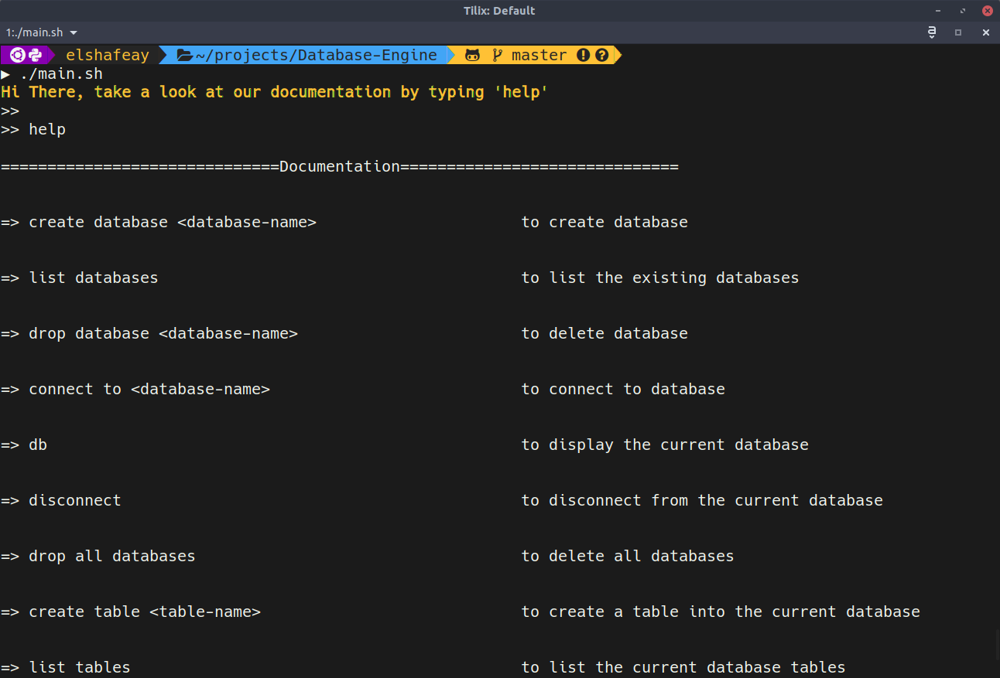
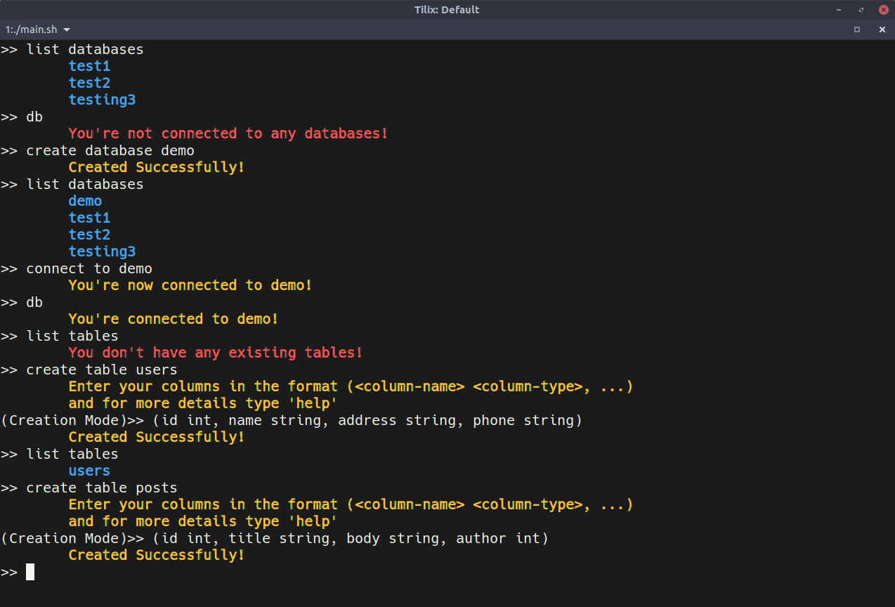
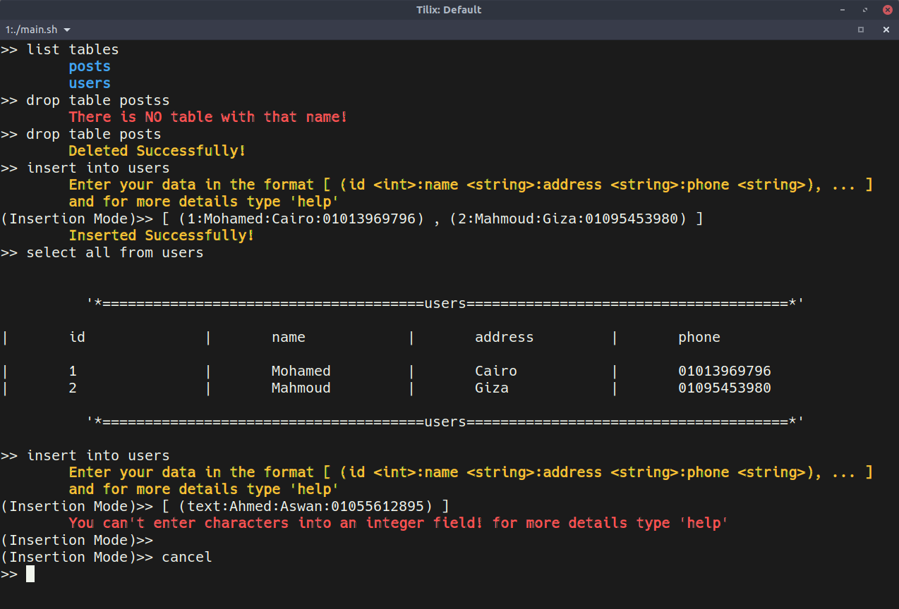
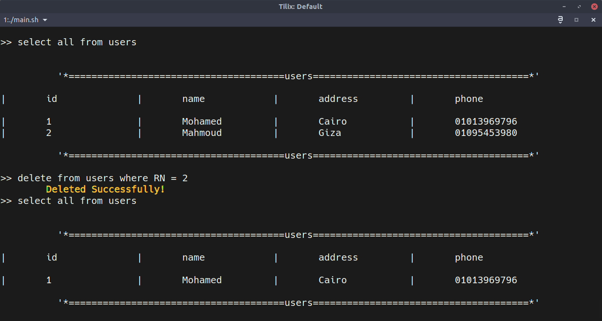
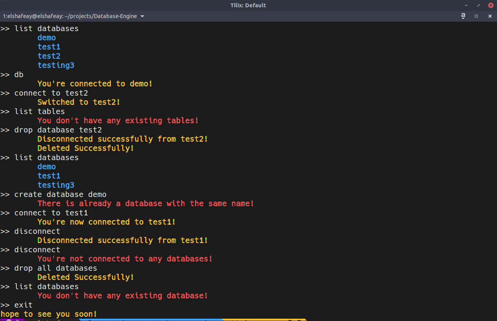

## This is a bash script project to simulate database engines

#### *After downloading the project run the following command to open the application*

```
$ ./main.sh
```
<br>

**And inside the script you can open the documentation anytime by typing**
```
help
```


<br>


---
#### Here is a simple demo of the project



<br>



<br>




<br>




<br>


